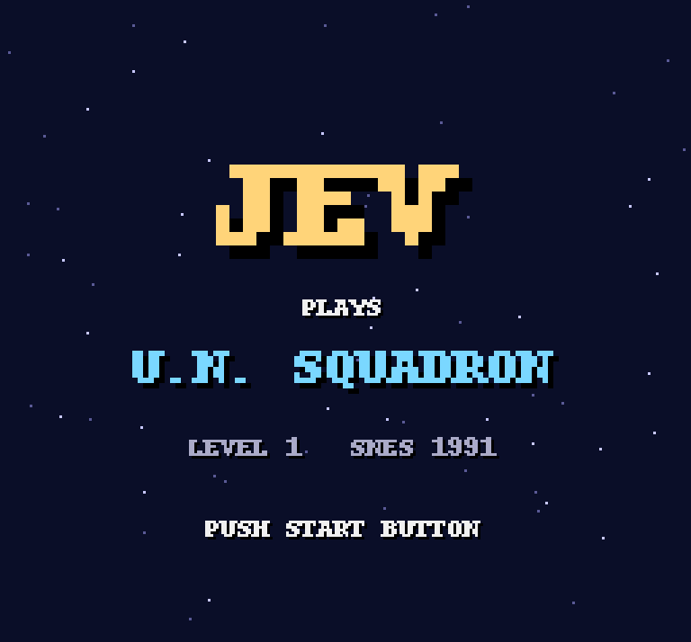
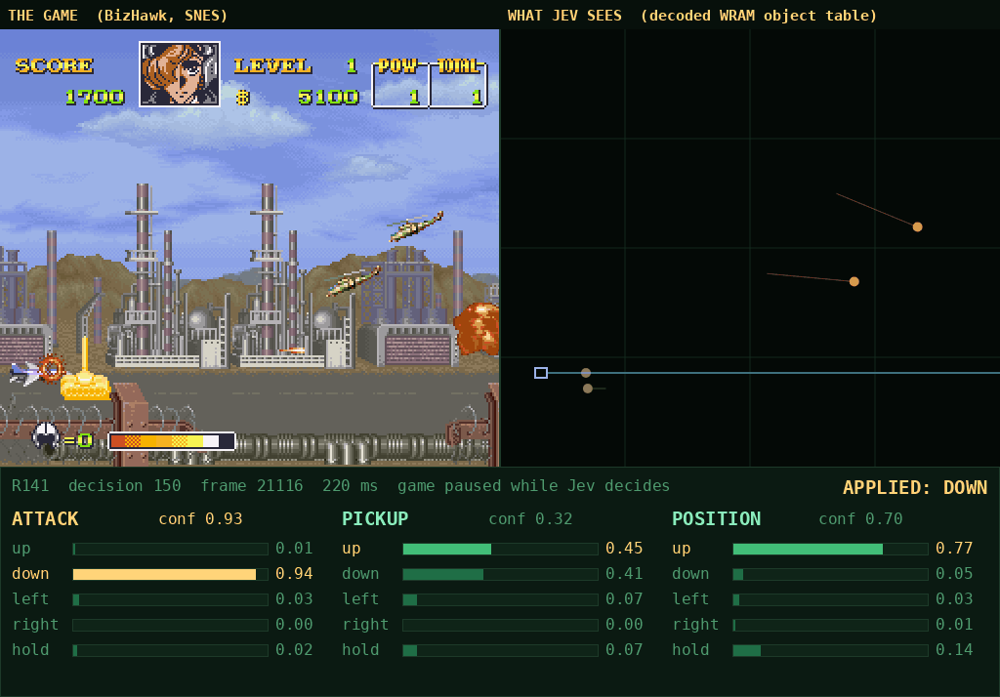
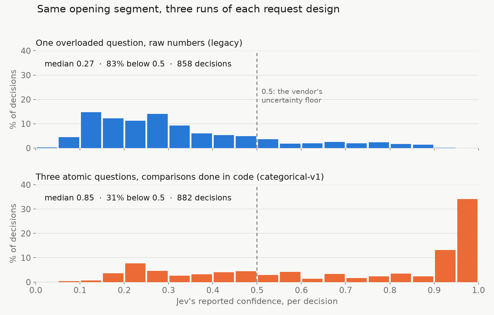
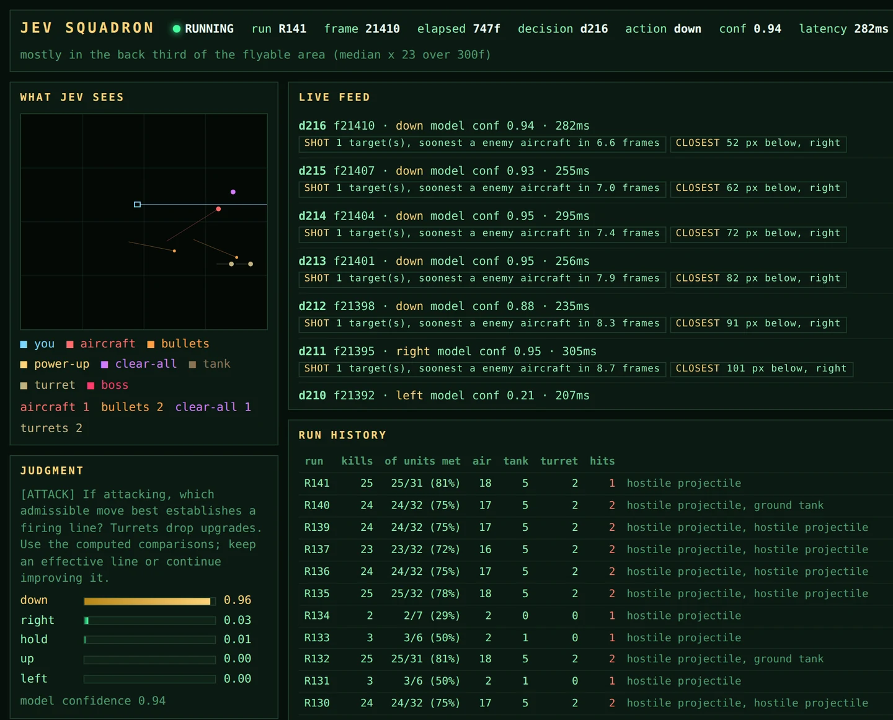

# Jev plays U.N. Squadron



This project has a decision model fly Capcom's 1991 SNES shooter *U.N. Squadron*, using the game's raw working memory. It doesn't use screen pixels, and nothing about the game is trained. BizHawk runs the ROM, a Lua script exports the game's RAM on every frame, and a Python controller asks [TypeSafe's Jev](https://docs.typesafe.ai) which way to move. The emulator stays frozen while the model thinks.

**Status:** Jev flies level 1 from takeoff to the boss. The best full-level run (R99) destroyed **82 of the 108** enemies it met, then died at the boss. **The boss has never been killed, and no boss part has ever been destroyed.** Level completion has not been demonstrated.

**Headline finding:** the vendor documentation says *"Jev is not a calculator. We strongly recommend implementing any mathematical logic in code."* The legacy request handed Jev about 1,600 characters of raw pixel distances per option and asked it to weigh them. The fix was to move every comparison into Python and split one overloaded question into three atomic ones. That took median confidence from **0.27 to 0.85** and made requests **83% smaller**.

## Contents

- [What Jev is](#what-jev-is)
- [How it works](#how-it-works)
- [What moved the numbers](#what-moved-the-numbers)
- [The request redesign](#the-request-redesign)
- [Where it stands](#where-it-stands)
- [Repository layout](#repository-layout)
- [Running it](#running-it)
- [Further reading](#further-reading)

## What Jev is

Jev is TypeSafe's first "System One" model, named after Kahneman's fast, intuitive mode of thinking. It reads natural language and never writes any. You send it a **state** and typed **questions**, and it returns a typed answer, a probability for every option, and a **confidence**.

- **It's trained for calibration, not preference.** TypeSafe calls its post-training RLCD: reinforcement learning for calibrated decisions. Chat models use RLHF, and reasoning models use RLVR. Across many answers, an option Jev rates at 0.8 should be right about 80% of the time, so code can branch on its confidence.
- **Answers are typed.** A Choice picks from your list, a Score rates something against levels you describe, and a Noul gives the probability that a statement is true. There's no text to parse.
- **It reads one state and answers many questions in parallel.** Adding questions barely changes latency, and the questions don't contaminate each other.
- **It's cheap.** It costs $0.042 per million input tokens, and output is free. By rough estimate at 4 bytes per token, a full level with the legacy ~25 KB request costs about 26¢, and the redesigned ~4 KB request costs about 4¢. The project ran on the free tier.

## How it works

1. **BizHawk 2.11** (Snes9x core) runs the ROM. [`lua/main.lua`](lua/main.lua) writes the game state to `runtime_state.json` on every frame and injects whatever input is in `runtime_action.json`.
2. **Reading the object table.** The game keeps its live objects in 64-byte records from WRAM `0x1000` to `0x1FC0`. Bytes 1–3 of each record hold the 24-bit address of the routine that updates the object, and that address is a stable type tag:

   | Routine | What it drives |
   |---|---|
   | `$02:B04A` | helicopters |
   | `$04:F97F` | enemy bullets |
   | `$02:9274`, `$02:90F0`, … | ground tanks (a family of routines) |
   | `$02:93DD` | turrets, which drop a power-up |
   | `$04:FABA` / `$04:FAD9` | the dropped power-up / the screen-clearing power-up |

   A type was adopted only after **two independent recordings** agreed. Player health is byte 8 of the player's own record: it starts at 8 and reaches 0 when the run ends.
3. **Pause-and-step.** On each decision frame, Lua calls `client.pause()`. Python asks Jev and writes the answer, and Lua applies it from the exact frame that was observed. **No game frames pass while the model thinks.** A 5-second watchdog unpauses the game if Python dies.
4. **Bounded runs.** Every run has a frame budget and a cap on paid requests, checks the ROM hash and the save-slot SHA-256, and closes only the emulator it opened.



## What moved the numbers

**Facts helped and instructions hurt.**
- **Measurements helped every time.** These include shot speed (11 px per frame), lopsided kill bands (aircraft from 8 px above to 17 px below; tanks from 6 px above to 10 px below), a 30-frame forecast for each move over a 4×8 grid (kills roughly doubled), walls learned from shots that stopped short, and the real health counter.
- **Instructions cost kills every time.** Five plain-language instructions written by coding agents each cost kills and were reverted. The four that were logged left runs at 36, 41, 37 and 13 kills.
- **Domain corrections from a human player were right every time.** These were: turrets first, boss parts can be damaged, tanks are reachable with a small drop, hug the ground, and hold the bottom left under the big missiles.

**Baselines:** a jet that sits still and fires kills 5 enemies. A Jev decision every 30 frames kills 10. With the measurements added, 1,800-frame runs reach 42 kills.

**The unit tests don't measure gameplay.** Every change gets a labelled run and is judged by `runs_table.py` and `benchmark.py`.

## The request redesign

`categorical-v1` ([`src/brain/decisions.py`](src/brain/decisions.py)) works out eligibility, objectives and gap comparisons in code. Jev then gets **three atomic questions in one call** (attack, pickup, position), and each option carries a categorical verdict instead of raw numbers.

I ran each design three times, interleaved, on the same 900-frame opening:

| | Request | Latency | Units destroyed | Median confidence |
|---|---:|---:|---:|---:|
| Legacy | 24.8 KB | 330 ms | 78% | **0.27** |
| categorical-v1 | 4.1 KB | 253 ms | 71% | **0.85** |



The first version lost units because of a blanket 0.5 confidence floor, which overrode 276 good answers across three runs. Removing the floor entirely killed three of five runs. The code now sets a **threshold per decision type, based on what a wrong answer costs**: 0.20 for attack, 0.30 for pickup, 0.45 for positioning, and 0.90 when escaping a collision. With those thresholds, the next three runs scored 75%, 75% and 81%. That matches legacy at a sixth of the request size. `categorical-v1` is opt-in and not the default yet.

## Where it stands

| | Best result |
|---|---|
| Full level | R99: 82 of 108 units (76%); reached the boss and died there |
| Boss fight | mean survival rose from 184 to 382 frames; best single attempt 566 |
| Boss parts destroyed | 0 |
| Undamaged runs | one: R8, 1,800 frames, 40 of 54 units |

**Open questions:**
- **The prelude hit.** Every run since R124 is hit at frame 20582, before Jev's first decision (20663). R8 and R99 weren't, so something in the setup changed.
- **Expected-unit manifest.** A per-column list of the enemies that should appear would turn each miss into a specific decision.
- **Boss hull health.** The hull parts probably have a health counter like the player's.
- **More A/B replicates** for `categorical-v1`.

**Negative results worth keeping:**
- Stage terrain can't be read from VRAM on this core. The best of about 900 tilemap alignments scored 92%, against a "sky above, ground below" null model at 93%.
- A quoted "63 columns" in the structure map was stale. The file held 34 cells across 17 columns.



## Repository layout

```
README.md, CLAUDE.md, config.json   entry points and emulator/ROM config
launchers/   double-click .bat files (and their .ps1 runners); each one cd's to the repo root
src/         Python controller, runners, dashboard and analysis tools
  brain/     observation decoding, combat digest, request building, categorical-v1 policy
tests/       offline unit tests (no emulator, no network, no key)
lua/         BizHawk scripts: main.lua bridge, probes, replay
data/        measured maps (terrain_map.json, danger_map.json) and sample Jev requests/responses
evidence/    hazard/health captures, per-slot evidence reports, probe outputs, screenshots
scripts/     PowerShell helpers that render evidence images
docs/        typesafe/ (vendor docs, 109 pages), notes/ (handoffs, audits, project state), media/
```

These are local only and gitignored: `runs/` (every run's logs and frames), `bizhawk/` (the emulator and save states), `typesafe_api_key.txt`, and the `runtime_*.json` IPC files at the root.

## Running it

Everything runs on Windows with BizHawk in `bizhawk\` and the ROM path in `config.json`. Launchers can be double-clicked from `launchers\`. Python commands run from the repo root.

**Experimental combat** (pause-and-step, gun on from the start). With BizHawk closed, `launchers\run_jev_segment.bat` opens slot 1 and makes at most **300 paid attempts** over 1,800 frames. It stops with **Ctrl+C** or `launchers\stop_segment.bat`, and it refuses to run if an emulator is already open.

```powershell
python src/run_segment.py --mode dry --stepped --prelude-fire --interval 6 --max-calls 300 --frames 1800   # zero API calls
python src/run_segment.py --mode baseline --prelude-fire --frames 420                                       # zero API calls
python src/run_segment.py --mode live --stepped --prelude-fire --interval 3 --max-calls 2400 --frames 6000 --change "what this run tests"
python src/run_segment.py ... --load-slot 3 --expected-start-frame 24121 --warmup 12                       # boss practice
```

Compare a run only against a baseline with the same prelude, frame budget and export.

**Measuring a change:**

```powershell
python src/runs_table.py --last 12 --full-level-only   # units destroyed, share, damage, change under test
python src/benchmark.py --recent 3 --baseline 12       # per level segment, against the previous band
python src/replay_run.py --best-boss                   # watch a run back on screen (no API calls)
```

**Dashboard:** `launchers\dashboard.bat` (or `python src/dashboard.py`) serves http://127.0.0.1:8770. It follows `runs/active_segment.json`, so leave it open across runs. It only reads run files, so it can't affect a run.

**D/L calibration launcher:** with your own BizHawk at the gameplay save and `lua/main.lua` active, double-click `launchers\launch.bat` and choose **D** (dry run) or **L** (live). `config.json` sets `max_calls` (default 60) and `decision_interval_frames` (default 30).

**No-key checks:**
- `launchers\run_brain_preview.bat` is a passive 900-frame watch with zero Jev requests.
- `launchers\run_projectile_probe.bat` runs deterministic captures into `evidence/hazard_observation/probe_*`.

**Tests and tools:**

```powershell
python -m unittest discover -s tests -t tests          # 115 offline tests
python src/check_bridge.py --mode calibrate
python src/replay_brain.py evidence/hazard_observation/probe_20260919-121654-34c1a8_pulse6 --at-sample 862
python src/survey_objects.py evidence/hazard_observation/<probe_folder> --from-sample 480
python src/build_terrain_map.py; python src/build_danger_map.py
```

**Rules for anyone continuing this:**
- **Keep the key local.** `typesafe_api_key.txt` must never be printed, logged or committed.
- **Slot 1 is read-only.** It must hash `c1ea750e…` and is never written.
- **Adopt a RAM slot only with evidence from two recordings.** Keep `lua/main.lua`'s `enemy_bases` equal to `ENEMY_BASES`.
- **Run `benchmark.py` after every change.**
- **Don't claim level completion.**

## Further reading

- [docs/notes/CLAUDE_HANDOFF.md](docs/notes/CLAUDE_HANDOFF.md) and [docs/notes/CODEX_HANDOFF.md](docs/notes/CODEX_HANDOFF.md): current state and resume points
- [docs/notes/SESSION_2026-09-20.md](docs/notes/SESSION_2026-09-20.md): the health re-scoring and the redesign
- [docs/notes/AUDIT_2026-09-20.md](docs/notes/AUDIT_2026-09-20.md): VRAM terrain attempts and the stale-number audit
- [docs/notes/MEMORY_MAP.md](docs/notes/MEMORY_MAP.md): every adopted WRAM address and its evidence
- [docs/typesafe/README.md](docs/typesafe/README.md): the vendor rules this project broke, and how it fixed them
- [evidence/hazard_observation/](evidence/hazard_observation/): per-slot adoption reports
